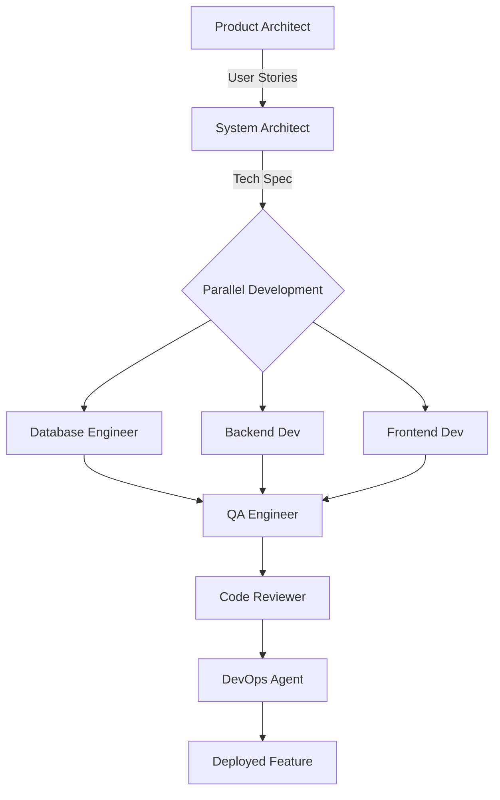

# 🤖 AI Agent Team Documentation
## Gym Transformation Tracker Development

**Version:** 1.0
**Last Updated:** 2025-11-14
**Project:** Gym Transformation Tracker (GTT)

---

## 📋 Overview

This directory contains the complete AI agent team configuration for building the Gym Transformation Tracker product. The team is structured like a real software development organization, with specialized agents and reusable skills.

### **Purpose**
- Accelerate product development by 3-5x
- Maintain consistency across features
- Build reusable capabilities for future products
- Enable parallel development workflows
- Ensure quality and best practices

---

## 🗂️ Directory Structure

```
.claude/
├── README.md                    # This file
├── docs/
│   ├── TECH_STACK.md           # Technology decisions
│   ├── ARCHITECTURE.md         # System architecture
│   └── DEVELOPMENT_GUIDE.md    # How to use agents
│
├── agents/                     # Specialized AI agents
│   ├── 01-product-architect.md
│   ├── 02-system-architect.md
│   ├── 03-frontend-dev.md
│   ├── 04-backend-dev.md
│   ├── 05-database-engineer.md
│   ├── 06-qa-engineer.md
│   ├── 07-integration-specialist.md
│   ├── 08-devops-agent.md
│   ├── 09-report-generator.md
│   └── 10-code-reviewer.md
│
├── skills/                     # Reusable capabilities
│   ├── frontend/
│   │   ├── pwa-builder.md
│   │   ├── component-library.md
│   │   ├── chart-builder.md
│   │   ├── mobile-first-ui.md
│   │   └── form-validator.md
│   │
│   ├── backend/
│   │   ├── api-designer.md
│   │   ├── auth-setup.md
│   │   ├── database-ops.md
│   │   ├── schema-designer.md
│   │   ├── reminder-system.md
│   │   └── multi-tenant-setup.md
│   │
│   ├── integration/
│   │   ├── sms-integrator.md
│   │   ├── whatsapp-integrator.md
│   │   ├── notification-setup.md
│   │   └── payment-gateway.md
│   │
│   ├── quality/
│   │   ├── test-suite-builder.md
│   │   ├── performance-tester.md
│   │   └── security-scanner.md
│   │
│   └── devops/
│       ├── deployment-pipeline.md
│       └── monitoring-setup.md
│
└── workflows/                  # Development workflows
    ├── feature-development.md
    ├── phase-kickoff.md
    ├── bug-fix.md
    └── production-deployment.md
```

---

## 👥 Agent Team Structure

### **Tier 1: Strategic Agents**
Planning and architectural decision-making

| Agent | Role | Primary Use |
|-------|------|-------------|
| `product-architect` | Converts PRD to technical specs | Phase planning, feature breakdown |
| `system-architect` | Designs technical architecture | Architecture decisions, system design |

### **Tier 2: Implementation Agents**
Core development work

| Agent | Role | Primary Use |
|-------|------|-------------|
| `frontend-dev` | Builds React/Next.js PWA | UI components, client-side logic |
| `backend-dev` | Builds Node.js APIs | API endpoints, business logic |
| `database-engineer` | Designs & optimizes database | Schema design, queries, migrations |

### **Tier 3: Quality & Integration**
Ensuring quality and connecting systems

| Agent | Role | Primary Use |
|-------|------|-------------|
| `qa-engineer` | Testing and quality assurance | Test creation, quality validation |
| `integration-specialist` | Third-party integrations | SMS, WhatsApp, payments, etc. |
| `devops-agent` | Deployment and infrastructure | CI/CD, hosting, monitoring |

### **Tier 4: Specialized Utilities**
Specific capabilities

| Agent | Role | Primary Use |
|-------|------|-------------|
| `report-generator` | PDF reports and exports | Transformation reports, data export |
| `code-reviewer` | Code quality and security | PR reviews, security checks |

---

## 🛠️ Skills Library

Skills are reusable, focused capabilities that agents invoke to perform specific tasks.

### **Frontend Skills (5)**
- `pwa-builder` - Progressive Web App setup
- `component-library` - Reusable UI components
- `chart-builder` - Data visualization
- `mobile-first-ui` - Responsive design patterns
- `form-validator` - Client-side validation

### **Backend Skills (6)**
- `api-designer` - RESTful API structure
- `auth-setup` - OTP authentication, JWT
- `database-ops` - CRUD operations
- `schema-designer` - Database schema creation
- `reminder-system` - Scheduled notifications
- `multi-tenant-setup` - Gym-specific data isolation

### **Integration Skills (4)**
- `sms-integrator` - SMS/OTP providers (Msg91, Twilio, Fast2SMS)
- `whatsapp-integrator` - WhatsApp Business API
- `notification-setup` - Push notifications
- `payment-gateway` - Razorpay, Stripe, etc.

### **Quality Skills (3)**
- `test-suite-builder` - Jest/Vitest test creation
- `performance-tester` - Load testing, optimization
- `security-scanner` - Vulnerability checking

### **DevOps Skills (2)**
- `deployment-pipeline` - CI/CD setup (GitHub Actions)
- `monitoring-setup` - Logging, error tracking

---

## 🚀 Quick Start Guide

### **Starting a New Feature**

```bash
# 1. Plan the feature
"Use product-architect agent to break down [feature name] into user stories"

# 2. Design the solution
"Use system-architect agent to design the technical approach for [feature]"

# 3. Implement
"Use backend-dev agent with api-designer skill to build [feature] API"
"Use frontend-dev agent with component-library skill to build [feature] UI"

# 4. Test
"Use qa-engineer agent to create tests for [feature]"

# 5. Review
"Use code-reviewer agent to review [feature] implementation"

# 6. Deploy
"Use devops-agent to deploy [feature] to staging"
```

### **Starting a New Phase**

```bash
"Use product-architect to create Phase [X] backlog from PRD"
"Use system-architect to design Phase [X] architecture"
```

---

## 📖 How Agents Work

### **Agent Invocation**
Each agent is a specialized prompt that guides Claude to think and act in a specific role with specific expertise.

### **Agent + Skill Combination**
Agents can invoke skills to perform specific tasks:
```
frontend-dev agent + pwa-builder skill = PWA implementation
backend-dev agent + auth-setup skill = Authentication system
```

### **Parallel Execution**
Multiple agents can work simultaneously on independent tasks:
```
Day 1:
├─ backend-dev → Builds API
├─ frontend-dev → Builds UI
└─ database-engineer → Creates schema

(All work in parallel, then integrate)
```

---

## 🎯 Development Workflow

### **Phase 1 Example: Member Tracking Feature**



**Steps:**
1. **Product Architect** creates user stories
2. **System Architect** designs solution
3. **Database Engineer**, **Backend Dev**, **Frontend Dev** work in parallel
4. **QA Engineer** tests integration
5. **Code Reviewer** ensures quality
6. **DevOps Agent** deploys

---

## 🔧 Tech Stack Configuration

### **Confirmed Decisions**
- **Database:** Supabase (PostgreSQL + Auth + Row-level Security)
- **Hosting:** Vercel (Frontend) + Railway (Backend, optional)
- **State Management:** Context API + additional tools as needed
- **Charts:** Recharts
- **Testing:** Jest/Vitest
- **CI/CD:** GitHub Actions

### **Flexible Decisions**
- **SMS Provider:** Multiple options (Msg91, Twilio, Fast2SMS)
- **Payment Gateway:** Multiple options (Razorpay, Stripe, Cashfree)
- **Analytics:** TBD based on requirements

See `docs/TECH_STACK.md` for detailed decisions.

---

## 📚 Agent Usage Examples

### **Example 1: Building Authentication**
```
User: "Build OTP-based authentication for gym members"

Process:
1. system-architect → Designs auth flow
2. backend-dev + auth-setup skill → Implements OTP system
3. frontend-dev → Builds login UI
4. qa-engineer → Tests auth flows
5. security-scanner skill → Validates security
```

### **Example 2: Creating Weekly Check-In**
```
User: "Implement weekly weight logging feature"

Process:
1. product-architect → Creates user stories
2. database-engineer + schema-designer → Creates weigh_in table
3. backend-dev + api-designer → Creates POST /weigh-in endpoint
4. frontend-dev + chart-builder → Builds WeighInForm + ProgressGraph
5. qa-engineer → Creates tests
6. code-reviewer → Reviews implementation
```

### **Example 3: Generating PDF Reports**
```
User: "Create transformation progress PDF report"

Process:
1. report-generator agent → Designs PDF template
2. backend-dev → Implements PDF generation API
3. frontend-dev → Adds "Download Report" button
4. qa-engineer → Tests PDF generation with various data
```

---

## 📝 Best Practices

### **When to Use Which Agent**

| Task | Agent | Why |
|------|-------|-----|
| Understanding requirements | `product-architect` | Breaks down PRD into actionable items |
| Making architectural decisions | `system-architect` | Designs system structure |
| Building UI | `frontend-dev` | Frontend expertise |
| Building API | `backend-dev` | Backend expertise |
| Database design | `database-engineer` | Database optimization |
| Adding integrations | `integration-specialist` | Third-party API expertise |
| Testing | `qa-engineer` | Quality assurance |
| Security review | `code-reviewer` | Security best practices |
| Deployment | `devops-agent` | Infrastructure expertise |

### **Agent Collaboration Tips**
1. **Start with planning agents** (product-architect, system-architect)
2. **Parallelize implementation** (backend-dev + frontend-dev + database-engineer)
3. **Integrate and test** (qa-engineer)
4. **Review and deploy** (code-reviewer → devops-agent)

### **Skill Reusability**
- Skills can be used across multiple projects
- Document learnings in skill files
- Update skills as best practices evolve

---

## 🔄 Continuous Improvement

### **Adding New Agents**
When you need new expertise:
1. Create agent definition in `agents/`
2. Document role, responsibilities, and skills used
3. Add to this README
4. Update workflows as needed

### **Adding New Skills**
When you need new capabilities:
1. Create skill definition in appropriate `skills/` subdirectory
2. Document inputs, outputs, and best practices
3. Add to this README
4. Test with relevant agent

### **Updating Workflows**
As development patterns emerge:
1. Document in `workflows/`
2. Share learnings across team
3. Refine agent collaboration

---

## 🎓 Learning Resources

- See individual agent files for detailed role descriptions
- See individual skill files for implementation guides
- See workflow files for step-by-step processes
- See `docs/` for architecture and technical decisions

---

## 📞 Getting Help

### **Common Commands**

```bash
# List all agents
ls .claude/agents/

# View specific agent
cat .claude/agents/03-frontend-dev.md

# List all skills
find .claude/skills/ -name "*.md"

# View specific skill
cat .claude/skills/backend/auth-setup.md
```

### **Troubleshooting**

**Q: Which agent should I use?**
A: Check the "Agent Team Structure" table above or the specific workflow in `workflows/`

**Q: How do I combine agents and skills?**
A: Agents automatically invoke relevant skills. You can also explicitly request: "Use [agent] with [skill] to [task]"

**Q: Can agents work in parallel?**
A: Yes! Request multiple agents in one message for parallel execution.

---

## 🚦 Project Status

### **Current Phase:** Phase 1 - Foundation
### **Agents Created:** 10/10
### **Skills Created:** 20/20
### **Workflows Created:** 4/4

---

## 📈 Next Steps

1. ✅ Review agent and skill documentation
2. ⏳ Start Phase 1 implementation
3. ⏳ Build core member tracking features
4. ⏳ Implement reminder system
5. ⏳ Create dashboards

---

**Ready to build! 🚀**

For detailed agent and skill documentation, see the respective directories.
