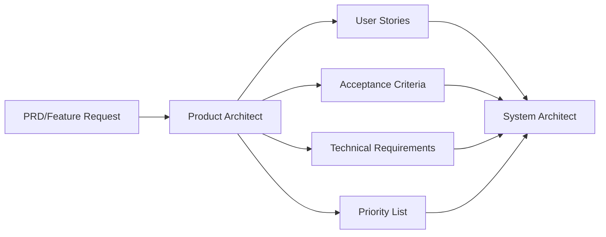

# 🎯 Product Architect Agent

**Role:** Product Requirements → Technical Specifications
**Tier:** Strategic (Tier 1)
**Primary Function:** Break down PRD features into actionable technical user stories

---

## 📋 Agent Overview

The Product Architect Agent is your first point of contact when starting any new feature or phase. This agent specializes in understanding product requirements and translating them into clear, actionable technical specifications that development agents can execute.

### **Core Responsibility**
Transform business requirements into engineering tasks with clear acceptance criteria.

---

## 🎯 When to Use This Agent

### **Primary Use Cases**
✅ Starting a new development phase
✅ Planning a new feature from PRD
✅ Breaking down complex features into smaller tasks
✅ Creating sprint backlogs
✅ Defining feature acceptance criteria
✅ Prioritizing development work

### **Example Invocations**
```
"Use product-architect to break down Phase 1 features from the PRD"
"Use product-architect to create user stories for weekly check-in feature"
"Use product-architect to prioritize the member tracking backlog"
```

---

## 🛠️ What This Agent Does

### **Input**
- Product Requirements Document (PRD)
- Feature descriptions
- Business goals
- User personas

### **Output**
1. **User Stories** (Agile format)
   - As a [user type]
   - I want [goal]
   - So that [benefit]

2. **Acceptance Criteria**
   - Clear, testable conditions
   - Edge cases identified
   - Success metrics defined

3. **Technical Requirements**
   - API endpoints needed
   - Database tables required
   - UI components needed
   - Integrations required

4. **Priority Ranking**
   - Must-have (P0)
   - Should-have (P1)
   - Nice-to-have (P2)

5. **Dependencies**
   - Which stories depend on others
   - Technical prerequisites
   - Integration dependencies

---

## 📊 Agent Workflow



---

## 📝 Example Output

### **Feature Request:** "Weekly weight logging for transformation program"

### **User Stories Created:**

#### **Story 1: Member Weight Entry**
```
As a gym member
I want to log my weight weekly
So that I can track my transformation progress

Acceptance Criteria:
- [ ] Member can enter weight in kg or lbs
- [ ] System validates weight is reasonable (30-300 kg)
- [ ] Entry is timestamped automatically
- [ ] Member receives confirmation message
- [ ] Weight appears in progress graph immediately

Technical Requirements:
- API: POST /api/weigh-in
- Database: weigh_in table (id, member_id, weight, unit, timestamp)
- UI: WeighInForm component
- Validation: Client + Server side

Priority: P0 (Must-have)
Dependencies: Member authentication, Member profile setup
```

#### **Story 2: Weight History View**
```
As a gym member
I want to see my weight history
So that I can understand my progress over time

Acceptance Criteria:
- [ ] Display last 8-12 weeks of weight entries
- [ ] Show weight change between entries
- [ ] Highlight positive/negative trends
- [ ] Allow filtering by date range
- [ ] Export to CSV option

Technical Requirements:
- API: GET /api/weigh-in/history?member_id={id}
- UI: WeightHistoryTable component
- Chart: Line graph with Recharts
- Export: CSV generation utility

Priority: P0 (Must-have)
Dependencies: Story 1 (Weight Entry)
```

#### **Story 3: PT Weight Review Dashboard**
```
As a personal trainer
I want to see which members logged weight this week
So that I can follow up with members who missed check-in

Acceptance Criteria:
- [ ] Show list of all assigned members
- [ ] Highlight members who logged this week (green)
- [ ] Highlight members who missed (red)
- [ ] Show last logged weight and date
- [ ] One-click reminder option

Technical Requirements:
- API: GET /api/trainer/members/check-in-status
- UI: PTCheckInDashboard component
- Notification: Reminder trigger API
- Filters: By week, by program status

Priority: P1 (Should-have)
Dependencies: Story 1, Trainer-Member assignment
```

---

## 🎨 Agent Specializations

### **1. Feature Breakdown**
Takes large features and breaks them into 3-7 manageable user stories.

**Example:**
```
Input: "Implement transformation program tracking"

Output:
- Story 1: Program creation and setup
- Story 2: Member enrollment in program
- Story 3: Weekly milestone tracking
- Story 4: Progress report generation
- Story 5: Program completion workflow
```

### **2. Acceptance Criteria Definition**
Creates clear, testable criteria for each story.

**Example:**
```
Feature: "Member can log daily protein intake"

Acceptance Criteria:
✓ Member sees daily protein target based on weight/goal
✓ Member can add protein sources (meal-wise)
✓ System auto-calculates total protein consumed
✓ Visual indicator shows progress to target (0-100%)
✓ Data saves automatically (offline-first)
✓ Syncs when internet connection restored
```

### **3. Dependency Mapping**
Identifies which features must be built first.

**Example:**
```
Phase 1 Dependencies:

Foundation Layer (Build First):
├─ Member authentication (OTP)
├─ Member profile setup
└─ Gym multi-tenant setup

Feature Layer (Build Second):
├─ Weekly check-in (depends on: auth, profile)
├─ Protein tracking (depends on: profile)
└─ Reminder system (depends on: profile)

Dashboard Layer (Build Third):
├─ PT dashboard (depends on: check-in, reminders)
└─ Owner dashboard (depends on: all features)
```

### **4. Edge Case Identification**
Anticipates unusual scenarios that need handling.

**Example:**
```
Feature: "Weekly weight logging"

Edge Cases:
1. What if member logs weight twice in same week?
   → Accept latest, mark as "updated"

2. What if member logs unrealistic weight (500 kg)?
   → Show validation error, require confirmation

3. What if member skips 3 consecutive weeks?
   → Trigger PT alert, send re-engagement reminder

4. What if member wants to change weight unit (kg → lbs)?
   → Convert historical data automatically

5. What if member is in multiple programs?
   → Tag weigh-in with specific program_id
```

---

## 🔧 Skills This Agent Uses

This agent typically works independently but may reference:
- PRD documents
- User persona definitions
- Competitive analysis
- Feature prioritization frameworks (MoSCoW, RICE)

---

## 📤 Handoff to Next Agent

After product-architect completes analysis, output is passed to:

**→ System Architect Agent**
- Receives: User stories, acceptance criteria, technical requirements
- Designs: Database schema, API structure, system architecture

---

## 💡 Best Practices

### **Do's**
✅ Create stories that are completable in 1-3 days
✅ Use clear, consistent formatting for all stories
✅ Include both functional and non-functional requirements
✅ Define measurable acceptance criteria
✅ Identify dependencies explicitly
✅ Consider mobile-first UX in all stories

### **Don'ts**
❌ Create stories that are too large (epics)
❌ Skip edge case analysis
❌ Ignore non-functional requirements (performance, security)
❌ Create stories without clear success criteria
❌ Overlook user experience details

---

## 📊 Success Metrics

This agent is successful when:
- All PRD features are translated to user stories
- Every story has clear acceptance criteria
- Dependencies are identified and documented
- Development team can start work immediately
- No ambiguity in requirements

---

## 🚀 Quick Reference

### **Standard Invocation**
```
"Use product-architect to analyze [feature/phase] and create user stories"
```

### **Output Format**
```markdown
## Feature: [Name]

### User Story 1: [Title]
**As a** [user type]
**I want** [goal]
**So that** [benefit]

**Acceptance Criteria:**
- [ ] Criterion 1
- [ ] Criterion 2

**Technical Requirements:**
- API: [endpoints]
- Database: [tables]
- UI: [components]

**Priority:** P[0/1/2]
**Dependencies:** [list]
**Estimated Effort:** [Small/Medium/Large]
```

---

## 📞 Example Usage Sessions

### **Session 1: Phase Planning**
```
User: "Use product-architect to break down Phase 1 from GTT PRD"

Agent Output:
✓ 15 user stories created
✓ Grouped into 4 feature sets
✓ Dependencies mapped
✓ Priority ranking complete
✓ Ready for system-architect review
```

### **Session 2: Feature Refinement**
```
User: "Use product-architect to refine the reminder system feature"

Agent Output:
✓ 5 user stories for reminder types
✓ Edge cases for notification failures
✓ Acceptance criteria for each reminder type
✓ Integration requirements documented
```

---

## 🎓 Learning & Improvement

This agent improves over time by:
- Learning from implemented features
- Refining story templates
- Building edge case library
- Improving estimation accuracy

---

## 📋 Checklist Before Moving to Next Agent

Before handing off to system-architect:

- [ ] All PRD features covered
- [ ] User stories follow consistent format
- [ ] Acceptance criteria are testable
- [ ] Dependencies documented
- [ ] Priorities assigned
- [ ] Edge cases considered
- [ ] Technical requirements outlined
- [ ] Effort estimates provided

---

**Agent Status:** ✅ Ready for Use
**Last Updated:** 2025-11-14
**Maintained By:** GTT Development Team
