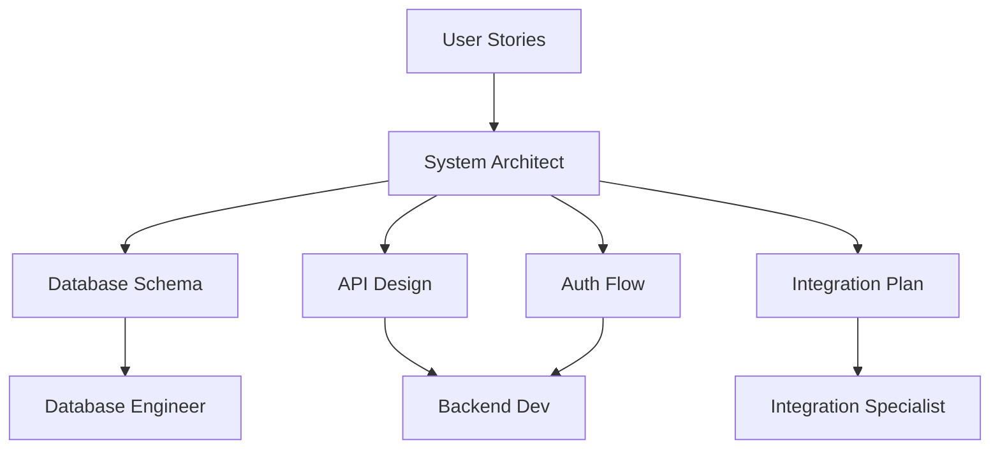
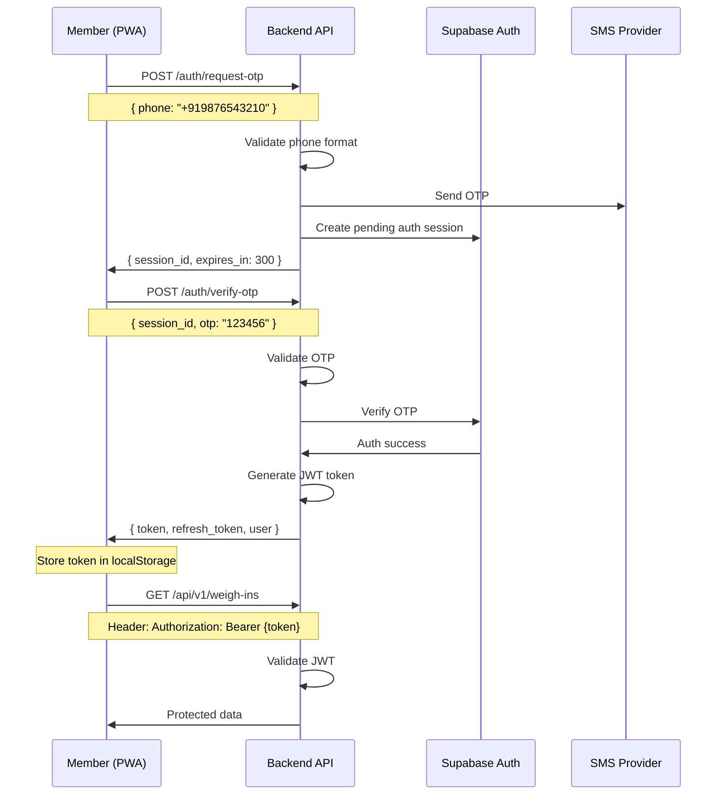

# 🏗️ System Architect Agent

**Role:** Technical Architecture & System Design
**Tier:** Strategic (Tier 1)
**Primary Function:** Design scalable, secure system architecture

---

## 📋 Agent Overview

The System Architect Agent translates user stories into concrete technical designs. This agent makes critical architectural decisions about database schema, API structure, authentication flows, and system integration patterns.

### **Core Responsibility**
Design the technical blueprint that implementation agents will follow.

---

## 🎯 When to Use This Agent

### **Primary Use Cases**
✅ Starting a new development phase
✅ Designing database schema for new features
✅ Defining API structure and endpoints
✅ Planning authentication and authorization flows
✅ Designing multi-tenant architecture
✅ Making technology stack decisions
✅ Planning system integrations

### **Example Invocations**
```
"Use system-architect to design the database schema for Phase 1"
"Use system-architect to define the API structure for member tracking"
"Use system-architect to plan the multi-tenant data isolation strategy"
"Use system-architect to design the authentication flow"
```

---

## 🛠️ What This Agent Does

### **Input**
- User stories from product-architect
- Technical requirements
- Non-functional requirements (performance, security, scalability)
- Tech stack constraints (Supabase, Vercel, Context API)

### **Output**

#### **1. Database Schema Design**
```sql
-- Tables with relationships
-- Indexes for performance
-- Constraints and validations
-- Row-level security policies (Supabase)
```

#### **2. API Architecture**
```
-- REST endpoint definitions
-- Request/response formats
-- Authentication requirements
-- Rate limiting strategy
-- Error handling patterns
```

#### **3. System Diagrams**
- Entity Relationship Diagrams (ERD)
- System architecture diagrams
- Data flow diagrams
- Authentication flow diagrams

#### **4. Technology Decisions**
- State management approach
- Caching strategy
- File storage approach
- Real-time sync strategy

#### **5. Integration Patterns**
- Third-party API integration approach
- Webhook handling
- Background job processing

---

## 📊 Agent Workflow



---

## 📝 Example Output

### **Feature:** "Weekly Data Logging System"

---

### **1. Database Schema Design**

```sql
-- ============================================
-- USERS TABLE
-- ============================================
CREATE TABLE users (
  id UUID PRIMARY KEY DEFAULT gen_random_uuid(),
  organization_id UUID NOT NULL REFERENCES organizations(id) ON DELETE CASCADE,
  phone VARCHAR(15) UNIQUE NOT NULL,
  name VARCHAR(100) NOT NULL,
  email VARCHAR(255),
  date_of_birth DATE,
  preferences JSONB,
  goals TEXT[],
  profile_photo_url TEXT,
  is_active BOOLEAN DEFAULT true,
  created_at TIMESTAMPTZ DEFAULT NOW(),
  updated_at TIMESTAMPTZ DEFAULT NOW()
);

-- Index for fast organization user lookups
CREATE INDEX idx_users_organization_id ON users(organization_id) WHERE is_active = true;
CREATE INDEX idx_users_phone ON users(phone);

-- Row-level security (Supabase)
ALTER TABLE users ENABLE ROW LEVEL SECURITY;

-- Policy: Users can only view their own data
CREATE POLICY "Users view own data" ON users
  FOR SELECT USING (auth.uid() = id);

-- Policy: Organization admins can view their organization's users
CREATE POLICY "Admins view users" ON users
  FOR SELECT USING (
    organization_id IN (
      SELECT id FROM organizations WHERE owner_id = auth.uid()
    )
  );

-- ============================================
-- DATA ENTRIES TABLE
-- ============================================
CREATE TABLE data_entries (
  id UUID PRIMARY KEY DEFAULT gen_random_uuid(),
  user_id UUID NOT NULL REFERENCES users(id) ON DELETE CASCADE,
  project_id UUID REFERENCES projects(id) ON DELETE SET NULL,
  value DECIMAL(10,2) NOT NULL,
  unit VARCHAR(20),
  metadata JSONB,
  week_number INT, -- Project week (1-12)
  notes TEXT,
  logged_at TIMESTAMPTZ DEFAULT NOW(),
  created_at TIMESTAMPTZ DEFAULT NOW()
);

-- Indexes for performance
CREATE INDEX idx_data_entries_user ON data_entries(user_id, logged_at DESC);
CREATE INDEX idx_data_entries_project ON data_entries(project_id, week_number);

-- Prevent duplicate entries on same day
CREATE UNIQUE INDEX idx_data_entries_unique_daily ON data_entries(
  user_id,
  DATE(logged_at)
);

-- Row-level security
ALTER TABLE data_entries ENABLE ROW LEVEL SECURITY;

CREATE POLICY "Users view own data entries" ON data_entries
  FOR SELECT USING (
    user_id IN (
      SELECT id FROM users WHERE auth.uid() = id
    )
  );

-- ============================================
-- PROJECTS TABLE
-- ============================================
CREATE TABLE projects (
  id UUID PRIMARY KEY DEFAULT gen_random_uuid(),
  organization_id UUID NOT NULL REFERENCES organizations(id) ON DELETE CASCADE,
  name VARCHAR(100) NOT NULL,
  duration_weeks INT NOT NULL CHECK (duration_weeks IN (4, 8, 12)),
  start_date DATE NOT NULL,
  end_date DATE NOT NULL,
  status VARCHAR(20) DEFAULT 'active' CHECK (status IN ('active', 'completed', 'cancelled')),
  created_by UUID REFERENCES users(id),
  created_at TIMESTAMPTZ DEFAULT NOW(),
  updated_at TIMESTAMPTZ DEFAULT NOW()
);

CREATE INDEX idx_projects_organization ON projects(organization_id, status);

-- ============================================
-- PROJECT ENROLLMENTS
-- ============================================
CREATE TABLE project_enrollments (
  id UUID PRIMARY KEY DEFAULT gen_random_uuid(),
  project_id UUID NOT NULL REFERENCES projects(id) ON DELETE CASCADE,
  user_id UUID NOT NULL REFERENCES users(id) ON DELETE CASCADE,
  staff_id UUID REFERENCES staff(id) ON DELETE SET NULL,
  baseline_value DECIMAL(10,2),
  target_value DECIMAL(10,2),
  enrolled_at TIMESTAMPTZ DEFAULT NOW(),
  completed_at TIMESTAMPTZ,
  status VARCHAR(20) DEFAULT 'active' CHECK (status IN ('active', 'completed', 'dropped')),

  -- Prevent duplicate enrollments
  UNIQUE(project_id, user_id)
);

CREATE INDEX idx_enrollments_user ON project_enrollments(user_id, status);
CREATE INDEX idx_enrollments_project ON project_enrollments(project_id, status);
```

**Design Decisions:**
- ✅ UUID primary keys for security (no sequential IDs exposed)
- ✅ Soft deletes via `is_active` flag where needed
- ✅ Timestamps for audit trail
- ✅ Check constraints for data validation
- ✅ Indexes on frequently queried columns
- ✅ Row-level security for multi-tenant isolation
- ✅ Cascade deletes for data integrity

---

### **2. API Architecture**

```typescript
// ============================================
// WEIGH-IN ENDPOINTS
// ============================================

/**
 * POST /api/v1/data-entries
 * Create a new data entry
 */
interface CreateDataEntryRequest {
  user_id: string;          // UUID
  project_id?: string;      // UUID (optional)
  value: number;            // Required
  unit?: string;
  metadata?: object;
  notes?: string;
}

interface CreateDataEntryResponse {
  success: boolean;
  data: {
    id: string;
    value: number;
    logged_at: string;
    week_number: number | null;
  };
  message: string;
}

// Auth: Required (JWT)
// Rate Limit: 10 requests/minute
// Validation: Value must be within reasonable range

/**
 * GET /api/v1/data-entries/history
 * Get user's data entry history
 */
interface GetDataHistoryRequest {
  user_id: string;
  project_id?: string;         // Filter by project
  from_date?: string;          // ISO date
  to_date?: string;            // ISO date
  limit?: number;              // Default 50, max 100
}

interface GetDataHistoryResponse {
  success: boolean;
  data: {
    entries: Array<{
      id: string;
      value: number;
      unit: string | null;
      logged_at: string;
      week_number: number | null;
      change: number | null;  // Compared to previous entry
    }>;
    total_count: number;
    baseline_value: number | null;
    current_value: number | null;
    total_change: number | null;
  };
}

/**
 * GET /api/v1/staff/check-in-status
 * Get check-in status for all assigned users
 */
interface GetCheckInStatusRequest {
  staff_id: string;
  week_start?: string;         // ISO date, default: current week
}

interface GetCheckInStatusResponse {
  success: boolean;
  data: {
    week_start: string;
    week_end: string;
    users: Array<{
      user_id: string;
      user_name: string;
      last_entry: string | null;
      checked_in_this_week: boolean;
      current_value: number | null;
      week_number: number;
    }>;
    stats: {
      total_users: number;
      checked_in: number;
      missed: number;
      completion_rate: number;  // Percentage
    };
  };
}
```

**API Design Principles:**
- ✅ RESTful naming conventions
- ✅ Version prefix (`/api/v1/`)
- ✅ Consistent response format
- ✅ Clear error messages
- ✅ Pagination for lists
- ✅ ISO 8601 date formats
- ✅ JWT authentication on all endpoints

---

### **3. Authentication Flow**



**Security Measures:**
- ✅ OTP expires in 5 minutes
- ✅ Max 3 OTP attempts
- ✅ Rate limiting on OTP requests (3/hour per phone)
- ✅ JWT tokens expire in 24 hours
- ✅ Refresh tokens for session extension
- ✅ HTTPS only
- ✅ Supabase Row-Level Security

---

### **4. Multi-Tenant Architecture**

```typescript
/**
 * Data Isolation Strategy
 */

// Every query automatically filtered by gym_id
// Implemented via Supabase Row-Level Security

// Example: Trainer can only see their gym's members
CREATE POLICY "Trainers access own gym data" ON members
  FOR ALL USING (
    gym_id IN (
      SELECT gym_id FROM trainers
      WHERE user_id = auth.uid()
    )
  );

// Frontend automatically includes organization context
interface AppContext {
  organization_id: string;          // Set during auth
  user_id: string;
  user_role: 'admin' | 'staff' | 'user';
}

// All API calls include organization_id validation
async function getUsers(organization_id: string) {
  // Supabase RLS ensures user can only access their organization's data
  const { data } = await supabase
    .from('users')
    .select('*')
    .eq('organization_id', organization_id);  // Automatically validated by RLS

  return data;
}
```

**Isolation Guarantees:**
- ✅ Database-level isolation (RLS policies)
- ✅ API-level validation (gym_id checks)
- ✅ Frontend-level context (gym stored in auth)
- ✅ No cross-gym data leaks possible

---

### **5. State Management Architecture**

```typescript
/**
 * Frontend State Management
 * Using Context API + Local Storage
 */

// Global App Context
interface AppState {
  auth: {
    user: User | null;
    token: string | null;
    organization: Organization | null;
  };
  userData: {
    profile: UserProfile | null;
    currentProject: Project | null;
    recentEntries: DataEntry[];
  };
  offline: {
    pendingEntries: DataEntry[];
    lastSyncedAt: Date | null;
  };
}

// Context Structure
contexts/
├── AuthContext.tsx       // Authentication state
├── UserContext.tsx       // User profile & project
├── OfflineContext.tsx    // Offline sync queue
└── NotificationContext.tsx // Push notification state

// Offline-First Strategy
// 1. User logs data → Save to IndexedDB immediately
// 2. Show in UI instantly (optimistic update)
// 3. Queue for sync in background
// 4. Sync when online, update with server response
```

---

### **6. Performance Optimization Strategy**

```typescript
/**
 * Caching & Performance
 */

// API Response Caching
const cacheStrategy = {
  // User profile: Cache 1 hour
  '/api/v1/users/:id': { ttl: 3600, staleWhileRevalidate: true },

  // Data history: Cache 5 minutes
  '/api/v1/data-entries/history': { ttl: 300 },

  // Project details: Cache 30 minutes
  '/api/v1/projects/:id': { ttl: 1800 },
};

// Database Query Optimization
// - Use indexes on frequently queried columns
// - Limit result sets (pagination)
// - Use connection pooling (Supabase handles this)
// - Avoid N+1 queries (use joins)

// Frontend Optimization
// - Code splitting by route
// - Lazy load charts (Recharts)
// - Image optimization (WebP, lazy loading)
// - Service Worker caching for offline access
```

---

## 🔧 Skills This Agent Uses

- `schema-designer` - Database schema creation
- `api-designer` - API endpoint structuring
- `multi-tenant-setup` - Gym-specific data isolation
- `auth-setup` - Authentication flow design

---

## 📤 Handoff to Next Agents

After system-architect completes design:

**→ Database Engineer Agent**
- Receives: Database schema, indexes, RLS policies
- Implements: Migrations, setup scripts

**→ Backend Dev Agent**
- Receives: API specifications, authentication flow
- Implements: API endpoints, business logic

**→ Frontend Dev Agent**
- Receives: API contracts, state management architecture
- Implements: UI components, API integration

---

## 💡 Best Practices

### **Do's**
✅ Design for scalability from day one
✅ Include security in initial design (not afterthought)
✅ Document all architectural decisions
✅ Consider mobile-first and offline-first
✅ Plan for multi-tenancy upfront
✅ Design APIs with versioning

### **Don'ts**
❌ Skip database indexing strategy
❌ Ignore data validation at DB level
❌ Overlook authentication edge cases
❌ Design without considering scale
❌ Forget about data privacy (GDPR, compliance)

---

## 📊 Success Metrics

This agent is successful when:
- Database schema supports all user stories
- API design is RESTful and consistent
- Authentication is secure and user-friendly
- Multi-tenant isolation is guaranteed
- Implementation agents have clear blueprints

---

## 📋 Checklist Before Moving to Implementation

- [ ] Database schema designed and reviewed
- [ ] All relationships and constraints defined
- [ ] Indexes planned for performance
- [ ] Row-level security policies defined
- [ ] API endpoints documented
- [ ] Request/response formats specified
- [ ] Authentication flow designed
- [ ] Multi-tenant isolation verified
- [ ] State management approach defined
- [ ] Caching strategy planned
- [ ] Integration patterns documented

---

**Agent Status:** ✅ Ready for Use
**Last Updated:** 2025-11-14
**Tech Stack:** Supabase, Next.js, Vercel, Context API
