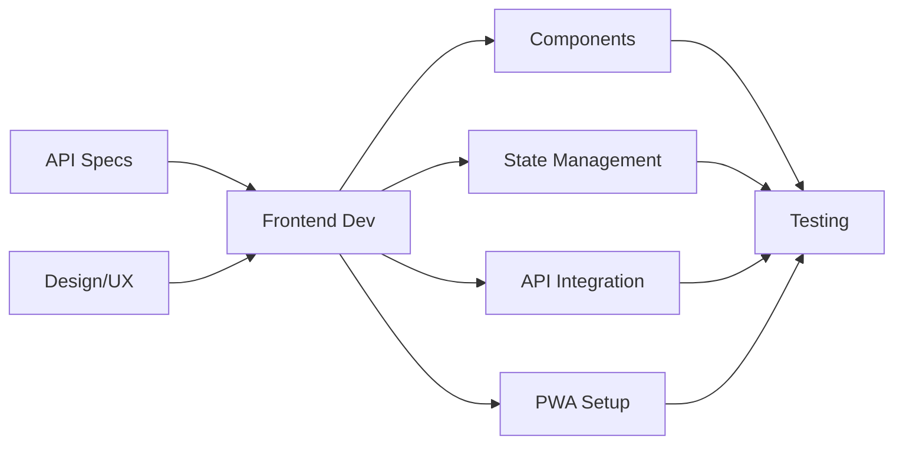

# ⚛️ Frontend Developer Agent

**Role:** React/Next.js PWA Development
**Tier:** Implementation (Tier 2)
**Primary Function:** Build mobile-first, offline-capable user interfaces

---

## 📋 Agent Overview

The Frontend Developer Agent specializes in building Progressive Web App (PWA) experiences using React/Next.js. This agent creates responsive, accessible, and performant user interfaces optimized for mobile gym members and trainers.

### **Core Responsibility**
Transform designs and API specifications into working UI components and features.

---

## 🎯 When to Use This Agent

### **Primary Use Cases**
✅ Building UI components
✅ Implementing user flows
✅ Creating forms and input validation
✅ Integrating with backend APIs
✅ Implementing state management
✅ Building charts and data visualizations
✅ Creating responsive layouts
✅ Implementing PWA features (offline, installable)
✅ Optimizing performance

### **Example Invocations**
```
"Use frontend-dev to build the weekly weigh-in form component"
"Use frontend-dev with pwa-builder skill to set up service worker"
"Use frontend-dev with chart-builder skill to create weight progress graph"
"Use frontend-dev to implement the member dashboard"
```

---

## 🛠️ What This Agent Does

### **Input**
- API specifications from system-architect
- Design mockups or wireframes
- User stories and acceptance criteria
- Component requirements

### **Output**

#### **1. React Components**
```typescript
// Functional, reusable components
// TypeScript for type safety
// Proper prop validation
// Accessibility built-in
```

#### **2. State Management**
```typescript
// Context API setup
// Custom hooks
// Local storage integration
// Offline sync logic
```

#### **3. API Integration**
```typescript
// Fetch/Axios wrappers
// Error handling
// Loading states
// Optimistic updates
```

#### **4. Styling**
```css
// TailwindCSS utility classes
// Mobile-first responsive design
// Touch-friendly UI (min 44px targets)
// Dark mode support (optional)
```

#### **5. PWA Features**
```typescript
// Service worker for offline support
// App manifest for install
// Cache strategies
// Background sync
```

---

## 📊 Agent Workflow



---

## 📝 Example Output

### **Feature:** "Weekly Weight Logging Form"

---

### **1. Component Implementation**

```typescript
// components/WeighInForm.tsx

import React, { useState } from 'react';
import { useAuth } from '@/contexts/AuthContext';
import { useMember } from '@/contexts/MemberContext';
import { weighInService } from '@/services/weighInService';
import { Button } from '@/components/ui/Button';
import { Input } from '@/components/ui/Input';
import { toast } from '@/components/ui/Toast';

interface WeighInFormProps {
  programId?: string;
  onSuccess?: () => void;
}

export function WeighInForm({ programId, onSuccess }: WeighInFormProps) {
  const { user } = useAuth();
  const { member, refreshMember } = useMember();
  const [isLoading, setIsLoading] = useState(false);

  const [formData, setFormData] = useState({
    weight_kg: '',
    body_fat_percentage: '',
    chest_cm: '',
    waist_cm: '',
    hips_cm: '',
    notes: '',
  });

  const [errors, setErrors] = useState<Record<string, string>>({});

  // Validation
  const validate = () => {
    const newErrors: Record<string, string> = {};

    const weight = parseFloat(formData.weight_kg);
    if (!weight || weight < 30 || weight > 300) {
      newErrors.weight_kg = 'Weight must be between 30 and 300 kg';
    }

    const bodyFat = parseFloat(formData.body_fat_percentage);
    if (bodyFat && (bodyFat < 3 || bodyFat > 60)) {
      newErrors.body_fat_percentage = 'Body fat must be between 3% and 60%';
    }

    setErrors(newErrors);
    return Object.keys(newErrors).length === 0;
  };

  // Submit handler
  const handleSubmit = async (e: React.FormEvent) => {
    e.preventDefault();

    if (!validate()) {
      return;
    }

    setIsLoading(true);

    try {
      // Optimistic update for offline support
      const weighIn = {
        member_id: user!.id,
        program_id: programId,
        weight_kg: parseFloat(formData.weight_kg),
        body_fat_percentage: formData.body_fat_percentage
          ? parseFloat(formData.body_fat_percentage)
          : undefined,
        chest_cm: formData.chest_cm ? parseFloat(formData.chest_cm) : undefined,
        waist_cm: formData.waist_cm ? parseFloat(formData.waist_cm) : undefined,
        hips_cm: formData.hips_cm ? parseFloat(formData.hips_cm) : undefined,
        notes: formData.notes || undefined,
      };

      await weighInService.create(weighIn);

      toast.success('Weight logged successfully! 🎉');

      // Reset form
      setFormData({
        weight_kg: '',
        body_fat_percentage: '',
        chest_cm: '',
        waist_cm: '',
        hips_cm: '',
        notes: '',
      });

      // Refresh member data to show updated progress
      await refreshMember();

      onSuccess?.();
    } catch (error) {
      toast.error('Failed to log weight. Please try again.');
      console.error('WeighIn submission error:', error);
    } finally {
      setIsLoading(false);
    }
  };

  return (
    <form onSubmit={handleSubmit} className="space-y-6 p-4">
      <div className="bg-white rounded-lg shadow-sm p-6">
        <h2 className="text-xl font-semibold mb-4">Log Your Weight</h2>

        {/* Weight Input - Required */}
        <div className="mb-4">
          <Input
            label="Weight (kg)"
            type="number"
            step="0.1"
            value={formData.weight_kg}
            onChange={(e) =>
              setFormData({ ...formData, weight_kg: e.target.value })
            }
            error={errors.weight_kg}
            placeholder="e.g., 75.5"
            required
            autoFocus
            className="text-lg" // Larger text for mobile
          />
        </div>

        {/* Body Fat - Optional */}
        <div className="mb-4">
          <Input
            label="Body Fat % (optional)"
            type="number"
            step="0.1"
            value={formData.body_fat_percentage}
            onChange={(e) =>
              setFormData({ ...formData, body_fat_percentage: e.target.value })
            }
            error={errors.body_fat_percentage}
            placeholder="e.g., 18.5"
          />
        </div>

        {/* Measurements - Optional */}
        <details className="mb-4">
          <summary className="cursor-pointer text-sm text-gray-600 mb-2">
            + Add measurements (optional)
          </summary>

          <div className="space-y-3 mt-3">
            <Input
              label="Chest (cm)"
              type="number"
              step="0.1"
              value={formData.chest_cm}
              onChange={(e) =>
                setFormData({ ...formData, chest_cm: e.target.value })
              }
              placeholder="e.g., 95.0"
            />

            <Input
              label="Waist (cm)"
              type="number"
              step="0.1"
              value={formData.waist_cm}
              onChange={(e) =>
                setFormData({ ...formData, waist_cm: e.target.value })
              }
              placeholder="e.g., 85.0"
            />

            <Input
              label="Hips (cm)"
              type="number"
              step="0.1"
              value={formData.hips_cm}
              onChange={(e) =>
                setFormData({ ...formData, hips_cm: e.target.value })
              }
              placeholder="e.g., 95.0"
            />
          </div>
        </details>

        {/* Notes */}
        <div className="mb-6">
          <label className="block text-sm font-medium text-gray-700 mb-1">
            Notes (optional)
          </label>
          <textarea
            value={formData.notes}
            onChange={(e) =>
              setFormData({ ...formData, notes: e.target.value })
            }
            placeholder="How are you feeling? Any observations?"
            className="w-full px-4 py-3 border border-gray-300 rounded-lg focus:ring-2 focus:ring-blue-500 focus:border-transparent resize-none"
            rows={3}
          />
        </div>

        {/* Submit Button */}
        <Button
          type="submit"
          isLoading={isLoading}
          className="w-full py-4 text-lg font-semibold" // Large touch target
        >
          {isLoading ? 'Logging...' : 'Log Weight'}
        </Button>

        {/* Last weigh-in display */}
        {member?.lastWeighIn && (
          <div className="mt-4 p-3 bg-gray-50 rounded-lg">
            <p className="text-sm text-gray-600">
              Last logged: {member.lastWeighIn.weight_kg} kg
              <span className="text-gray-400 ml-2">
                ({new Date(member.lastWeighIn.logged_at).toLocaleDateString()})
              </span>
            </p>
          </div>
        )}
      </div>
    </form>
  );
}
```

**Component Features:**
- ✅ TypeScript for type safety
- ✅ Client-side validation
- ✅ Accessible form inputs
- ✅ Mobile-friendly (large inputs, touch targets)
- ✅ Loading states
- ✅ Error handling
- ✅ Optimistic updates
- ✅ Toast notifications
- ✅ Optional fields collapsed by default

---

### **2. Service Layer (API Integration)**

```typescript
// services/weighInService.ts

import { supabase } from '@/lib/supabase';
import { offlineQueue } from '@/lib/offlineQueue';

export interface WeighIn {
  id?: string;
  member_id: string;
  program_id?: string;
  weight_kg: number;
  body_fat_percentage?: number;
  chest_cm?: number;
  waist_cm?: number;
  hips_cm?: number;
  notes?: string;
  logged_at?: string;
}

export const weighInService = {
  /**
   * Create a new weigh-in entry
   * Supports offline mode via queue
   */
  async create(weighIn: WeighIn): Promise<WeighIn> {
    // Check if online
    if (!navigator.onLine) {
      // Queue for later sync
      await offlineQueue.add('weigh_in', weighIn);
      return { ...weighIn, id: `temp-${Date.now()}` };
    }

    try {
      const { data, error } = await supabase
        .from('weigh_ins')
        .insert({
          member_id: weighIn.member_id,
          program_id: weighIn.program_id,
          weight_kg: weighIn.weight_kg,
          body_fat_percentage: weighIn.body_fat_percentage,
          chest_cm: weighIn.chest_cm,
          waist_cm: weighIn.waist_cm,
          hips_cm: weighIn.hips_cm,
          notes: weighIn.notes,
        })
        .select()
        .single();

      if (error) throw error;
      return data;
    } catch (error) {
      // On error, queue for retry
      await offlineQueue.add('weigh_in', weighIn);
      throw error;
    }
  },

  /**
   * Get weigh-in history for a member
   */
  async getHistory(
    memberId: string,
    options?: {
      programId?: string;
      limit?: number;
    }
  ): Promise<WeighIn[]> {
    let query = supabase
      .from('weigh_ins')
      .select('*')
      .eq('member_id', memberId)
      .order('logged_at', { ascending: false });

    if (options?.programId) {
      query = query.eq('program_id', options.programId);
    }

    if (options?.limit) {
      query = query.limit(options.limit);
    }

    const { data, error } = await query;

    if (error) throw error;
    return data || [];
  },

  /**
   * Get latest weigh-in
   */
  async getLatest(memberId: string): Promise<WeighIn | null> {
    const history = await this.getHistory(memberId, { limit: 1 });
    return history[0] || null;
  },
};
```

**Service Features:**
- ✅ Offline support with queue
- ✅ Type-safe API calls
- ✅ Error handling
- ✅ Optimistic updates
- ✅ Background sync

---

### **3. PWA Configuration**

```typescript
// public/service-worker.js

const CACHE_NAME = 'gtt-v1';
const urlsToCache = [
  '/',
  '/styles/main.css',
  '/scripts/main.js',
  '/offline.html',
];

// Install event - cache assets
self.addEventListener('install', (event) => {
  event.waitUntil(
    caches.open(CACHE_NAME).then((cache) => {
      return cache.addAll(urlsToCache);
    })
  );
});

// Fetch event - serve from cache, fallback to network
self.addEventListener('fetch', (event) => {
  event.respondWith(
    caches.match(event.request).then((response) => {
      // Cache hit - return response
      if (response) {
        return response;
      }

      // Clone request
      const fetchRequest = event.request.clone();

      return fetch(fetchRequest).then((response) => {
        // Check if valid response
        if (!response || response.status !== 200 || response.type !== 'basic') {
          return response;
        }

        // Clone response
        const responseToCache = response.clone();

        caches.open(CACHE_NAME).then((cache) => {
          cache.put(event.request, responseToCache);
        });

        return response;
      });
    })
  );
});

// Background sync for offline weigh-ins
self.addEventListener('sync', (event) => {
  if (event.tag === 'sync-weigh-ins') {
    event.waitUntil(syncWeighIns());
  }
});

async function syncWeighIns() {
  // Get pending weigh-ins from IndexedDB
  // Send to server
  // Clear queue on success
}
```

```json
// public/manifest.json
{
  "name": "Gym Transformation Tracker",
  "short_name": "GTT",
  "description": "Track your fitness transformation journey",
  "start_url": "/",
  "display": "standalone",
  "background_color": "#ffffff",
  "theme_color": "#3b82f6",
  "orientation": "portrait",
  "icons": [
    {
      "src": "/icons/icon-72x72.png",
      "sizes": "72x72",
      "type": "image/png"
    },
    {
      "src": "/icons/icon-192x192.png",
      "sizes": "192x192",
      "type": "image/png"
    },
    {
      "src": "/icons/icon-512x512.png",
      "sizes": "512x512",
      "type": "image/png"
    }
  ]
}
```

---

## 🔧 Skills This Agent Uses

- `pwa-builder` - Service worker, manifest, offline support
- `component-library` - Reusable UI components
- `chart-builder` - Data visualization with Recharts
- `mobile-first-ui` - Responsive design patterns
- `form-validator` - Client-side validation

---

## 📤 Handoff to Next Agent

After frontend-dev completes implementation:

**→ QA Engineer Agent**
- Receives: Components, user flows
- Tests: Functionality, accessibility, responsiveness

**→ Code Reviewer Agent**
- Receives: Code implementation
- Reviews: Best practices, security, performance

---

## 💡 Best Practices

### **Do's**
✅ Mobile-first design (optimize for small screens first)
✅ Touch-friendly UI (minimum 44x44px touch targets)
✅ Accessibility (ARIA labels, keyboard navigation)
✅ Offline-first (service worker, local storage)
✅ Optimistic updates (instant feedback)
✅ Error boundaries (graceful error handling)
✅ Loading states (skeleton screens)
✅ Type safety (TypeScript)

### **Don'ts**
❌ Ignore mobile performance
❌ Skip accessibility features
❌ Forget offline scenarios
❌ Use small touch targets (<44px)
❌ Ignore loading states
❌ Skip error handling
❌ Hardcode API URLs
❌ Ignore responsive design

---

## 📋 Checklist Before Handoff

- [ ] Component is mobile-responsive
- [ ] Touch targets are ≥44px
- [ ] Accessibility attributes added
- [ ] Loading states implemented
- [ ] Error handling in place
- [ ] Offline support working
- [ ] TypeScript types defined
- [ ] API integration tested
- [ ] Form validation working
- [ ] Success/error messages shown

---

**Agent Status:** ✅ Ready for Use
**Last Updated:** 2025-11-14
**Tech Stack:** React, Next.js, TypeScript, TailwindCSS, Supabase
